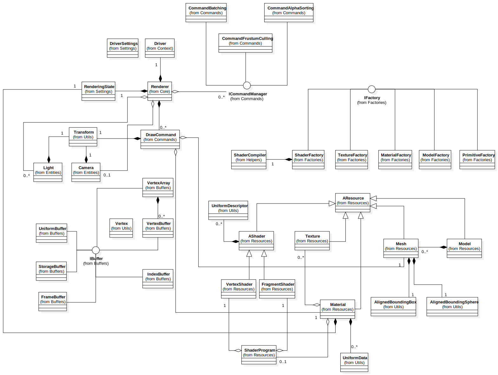

# Baguette Engine
Baguette Engine is a work in progress rendering engine.
My goal with this project is to learn more about advanced rendering techniques (Animation, shadow mapping, PBR, batching, PVS...) and to expose this features in a simple way for the user. Everything should be kept simple, but optimized.

## Software design
Here is a draft of the current architecture I imagined for Baguette Engine. It is subject to change, but it helps me to solve design problems upstreams.

<i>Source file: Docs/UML.svg</i>
